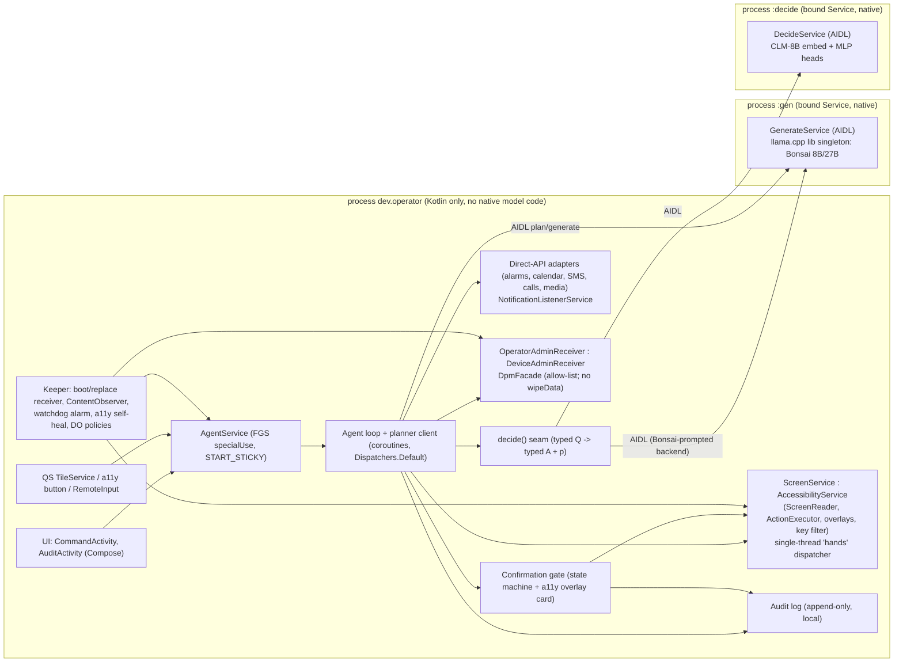

# 01 · Architecture, lifecycle and owner UX

Lane 01 of the operator design research, written 2026-09-27. Design only: nothing here was built, installed or run on the phone.

Tags: **VERIFIED [n]** = checked against numbered source n; **UNVERIFIED** = not checked, with what would check it; **INFERENCE** = my reasoning from verified facts.

## Scope (questions covered)

1. How the code is split into Gradle modules, and how the components are placed: app/UI, AccessibilityService ("hands"), DeviceAdminReceiver (device owner), inference service with the llama.cpp JNI, agent loop, audit log.
2. Whether to use one process or a separate `:inference` process: isolation from native crashes and OOM kills, against the cost of IPC and extra memory; binder payload limits.
3. Threading: coroutines, a dedicated native inference thread, and accessibility callbacks on the main thread.
4. Staying alive on OxygenOS 16 / Android 16:
   - which foreground-service (FGS) type fits;
   - what device-owner (DO) status exempts;
   - `setUserControlDisabledPackages`;
   - boot receivers;
   - how the a11y service is re-enabled through `WRITE_SECURE_SETTINGS`;
   - what dontkillmyapp and OnePlus sources say.
5. Owner UX:
   - how commands are given (text, voice, overlay, notification reply, QS tile, assistant role, share target);
   - how progress is shown;
   - confirmation UX that the agent's own a11y actions cannot press (lane 05 owns its security);
   - the kill switch.

Not in this lane:
- model and runtime choice (02);
- `decide()` internals (03);
- screen encoding and loop policy (04);
- the action set and the gate's security (05);
- DO provisioning (06);
- evaluation and CI (07).

## Findings

### F1. The a11y service must not share a process with native inference (the key finding)

- **F1.1** VERIFIED [11][12]. When the process hosting an accessibility service dies, AOSP does three things:
  - `AccessibilityServiceConnection.binderDied()` marks the service `crashed = true`;
  - `AccessibilityUserState.serviceDisconnectedLocked()` adds it to `mCrashedServices`;
  - `updateServicesLocked` then **skips** crashed components ("Skip the component since it may be in process or crashed.") [10].
- **F1.2** VERIFIED [10][12]. After that, the service stays enabled in `Settings.Secure` but **unbound** until one of these happens:
  - the package is updated (`onPackageUpdateFinished`);
  - the package is removed;
  - the user switches;
  - the service is removed from the enabled list and added back: `removeDisabledServicesFromTemporaryStatesLocked` "Remove from mCrashedServices, since users may toggle the on/off switch to retry" [12];
  - the phone reboots (the state is in memory; INFERENCE from [12]).
- **F1.3** VERIFIED [10]. Force-stopping the package goes further: `onPackagesForceStoppedLocked` removes the service from `ENABLED_ACCESSIBILITY_SERVICES` and **persists** that. It also removes the service's accessibility-button targets.
- **F1.4** VERIFIED [26]. dontkillmyapp's Oppo/ColorOS page reports that background services "including accessibility services, which then need re-enabling" are killed on screen-off. It covers only an old Oppo F1S. INFERENCE: this matches F1.1–F1.3; a killed a11y process is left "crashed" or "stopped".
- **F1.5** INFERENCE. Consequence: a SIGSEGV, SIGABRT or LMK kill of a process that loads a 1–4 GB model would silently disarm the hands until they are toggled. The native inference therefore goes in a separate process. The main process runs a self-heal routine (F6.4) that toggles the service with `WRITE_SECURE_SETTINGS`.
- **F1.6** VERIFIED [30]. The upstream `examples/llama.android/lib` keeps its native state in static globals (`g_model`, `g_context`, `g_batch`, `g_sampler`, `chat_msgs`). `InferenceEngineImpl` is a process singleton with one `Dispatchers.IO.limitedParallelism(1)` dispatcher.
- **F1.7** INFERENCE. As shipped, the upstream lib holds **one model per process**. Keeping generate (Bonsai) and decide (CLM-8B) loaded at the same time means one of two things:
  - one process per role; or
  - lane 02 rewrites the JNI to hold several instances.
  Per-role processes work with the upstream code unchanged.
- **F1.8** VERIFIED [30]. The upstream engine sets `_cancelGeneration` and checks it only between generated tokens. Prompt processing (`ProcessingUserPrompt`) is marked uninterruptible (`isUninterruptible`). INFERENCE: a long screen-dump prefill cannot be cancelled cooperatively, so the only hard stop within a bounded time is killing the inference process. This is a second reason for a separate process.

### F2. IPC cost

- **F2.1** VERIFIED [21]. The binder transaction buffer "has a limited fixed size, currently 1MB, which is shared by all transactions in progress for the process".
- **F2.2** INFERENCE. The payloads are:
  - screen text: tens of KB;
  - token deltas;
  - CLM embeddings or scores: 512 floats.
  All fit easily. Screenshots, or any image the planner might get later, must go through `SharedMemory`, `HardwareBuffer` or a file descriptor, never inline in a `Parcel`.
- **F2.3** UNVERIFIED. The RSS cost of a second or third ART process on this phone. Measure: PSS of an empty bound-service process (`dumpsys meminfo <pid>`), see M4.
- **F2.4** INFERENCE. Model weights are loaded with mmap, so they are file-backed and each model is resident only in the process that loads it. The extra cost per process is the ART baseline plus that process's KV cache and compute buffers, not the weights again.

### F3. Threading

- **F3.1** INFERENCE (standard `Service` behaviour; not checked against a doc line). `AccessibilityService` lifecycle and `onAccessibilityEvent` callbacks run on the main looper.
- **F3.2** The draft `ScreenService` already follows this. VERIFIED [31]: `onAccessibilityEvent` is a no-op, and screen reads happen on demand.
- **F3.3** Design rules that follow:
  - `onAccessibilityEvent` only stamps "last change" times, used for screen-settled detection (lane 04).
  - Tree walks and gesture dispatch run on a single-threaded `hands` dispatcher.
  - The agent loop runs on `Dispatchers.Default`.
  - Inference runs in its own process on one dispatcher thread, with native worker threads chosen by llama.cpp (`n_threads` clamp in `ai_chat.cpp` [30]).
  - UNVERIFIED: that `getWindows()` and `AccessibilityNodeInfo` traversal are safe off the main thread. Check with a strict-mode and ANR soak on the device (M6).

### F4. Foreground-service type on Android 16

| Type | Fits operator? | Evidence |
|---|---|---|
| `specialUse` | Yes. "Covers any valid foreground service use cases that aren't covered by the other foreground service types". Needs `FOREGROUND_SERVICE_SPECIAL_USE` and a `PROPERTY_SPECIAL_USE_FGS_SUBTYPE` property. No runtime prerequisites and no timeout. | VERIFIED [1][8] |
| `systemExempted` | Allowed for us. Eligible apps include "App is a Device Owner" and "Device Admin apps", otherwise the system throws `ForegroundServiceTypeNotAllowedException` [1]. `ActiveServices` grants it for `REASON_DEVICE_OWNER`, `REASON_ACTIVE_DEVICE_ADMIN`, `REASON_DISALLOW_APPS_CONTROL` and others [9]. Permission is `normal` [8]. It stops working if DO is removed (development builds are `testOnly`). | VERIFIED [1][8][9] |
| `dataSync` | No. 6 h per 24 h shared limit, then `onTimeout` and a `RemoteServiceException` crash [3]. Cannot start from `BOOT_COMPLETED` on target 35+ [3]. | VERIFIED [3] |
| `mediaProcessing` | No. 6 h per 24 h limit. | VERIFIED [1] |
| `shortService` | No. About 3 minutes, then an ANR. | VERIFIED [1] |
| `microphone` | Only while listening for voice. Cannot start from `BOOT_COMPLETED` [3]. The while-in-use rule is waived for a DO: `ActiveServices`: "Allow FGS while-in-use if the caller is the device owner." | VERIFIED [3][9] |

- **F4.1** VERIFIED [3]. The Android 15 `BOOT_COMPLETED` ban covers `dataSync`, `camera`, `mediaPlayback`, `phoneCall`, `mediaProjection` and `microphone`. `specialUse` and `systemExempted` are not on the list.
- **F4.2** VERIFIED [4][5]. Android 16 makes jobs that run alongside an FGS "adhere to their respective runtime quotas", and ignores `setImportantWhileForeground`. INFERENCE: the agent loop must run inside the FGS or a bound service, never inside WorkManager jobs.

### F5. What device-owner status gives for lifecycle

| Exemption | Status | Evidence |
|---|---|---|
| Background FGS start | Exempt. "System roles/permissions – device owners, profile owners" | VERIFIED [2] |
| App Standby bucket | `STANDBY_BUCKET_EXEMPTED` for an active device admin (`isActiveDeviceAdmin`) and for admin-protected packages | VERIFIED [13] |
| Background restriction (`AppRestrictionController`) | `REASON_ACTIVE_DEVICE_ADMIN` system exemption | VERIFIED [14] |
| Task Manager "Stop" button (Android 13+ FGS list) | Hidden for `REASON_DEVICE_OWNER` and `REASON_DISALLOW_APPS_CONTROL` in AOSP SystemUI (`UIControl.HIDE_BUTTON`). OxygenOS SystemUI may differ: UNVERIFIED, check in M2. | VERIFIED [15] |
| Force-stop and clear data from Settings | `setUserControlDisabledPackages`: "User will not be able to clear app data or force-stop packages … Packages with user control disabled are exempted from App Standby Buckets." Callable by the DO. | VERIFIED [7] |
| Doze | **Not** exempt: "DPC apps themselves are not automatically exempted from Doze mode either." | VERIFIED [7] |
| `setApplicationExemptions` (`EXEMPT_FROM_POWER_RESTRICTIONS`, etc.) | Not available to us. `@SystemApi`, and needs `MANAGE_DEVICE_POLICY_APP_EXEMPTIONS`, protection level `internal\|role` | VERIFIED [7][8] |
| Battery-optimisation allow-list | Exemption from background FGS start when "user turns off battery optimizations" [2]. `REQUEST_IGNORE_BATTERY_OPTIMIZATIONS` is a `normal` permission [8]; the user confirms once in a system dialog. | VERIFIED [2][8] |

- **F5.1** INFERENCE. Doze does not stop an agent run that the owner started, because the screen is on while the agent drives the UI. Scheduled tasks ("at 07:00 do X") need `setExactAndAllowWhileIdle` or `setAlarmClock`. Apps holding `SCHEDULE_EXACT_ALARM` or `USE_EXACT_ALARM` are also listed as eligible for `systemExempted` [1] (VERIFIED).
- **F5.2** VERIFIED [11]. The system binds a11y services with `BIND_FOREGROUND_SERVICE_WHILE_AWAKE | BIND_ALLOW_BACKGROUND_ACTIVITY_STARTS`. INFERENCE: while the screen is on, the hands process has FGS-level priority and may start activities from the background, which also opens the "can start an activity" FGS exemption [2]. When the screen is off, our own FGS carries the process.

### F6. OEM killing, boot, and self-heal

- **F6.1** VERIFIED [25]. dontkillmyapp's OnePlus page gives OnePlus its worst rating (5/5) and names these settings:
  - lock the app in Recents;
  - disable battery optimisation, "OnePlus started reverting this setting randomly";
  - App Auto-Launch;
  - "Deep Optimization … the main app killer";
  - Sleep standby optimisation.
  The page covers only OnePlus 3–6 and does not mention accessibility services. Nothing current exists for OxygenOS 16, which is ColorOS-based.
- **F6.2** UNVERIFIED. Whether OxygenOS 16's proprietary background management respects the AOSP DO, admin and user-control exemptions in F5, whether it treats a bound a11y service as protected, and whether it force-stops the app (F1.3) or only kills it (F1.1). Only a soak test on the device answers this (M2).
- **F6.3** VERIFIED [10]. Binding checks only the DPM permitted-services list (`isAccessibilityTargetAllowed` → `getPermittedAccessibilityServices`). The Enhanced Confirmation (restricted settings) path appears only in `sendRestrictedDialogIntent`, which serves the Settings UI. INFERENCE: writing `ENABLED_ACCESSIBILITY_SERVICES` directly (with `WRITE_SECURE_SETTINGS`) is not blocked by restricted settings; lane 06 confirms on the device.
- **F6.4** INFERENCE. Self-heal (the "Keeper") needs three triggers:
  1. **Process start.** `Application.onCreate`, reached from `BOOT_COMPLETED`, `MY_PACKAGE_REPLACED`, an FGS `START_STICKY` restart, the periodic watchdog, or the user opening the app.
  2. **A `ContentObserver`** on `Settings.Secure.ENABLED_ACCESSIBILITY_SERVICES`.
  3. **A watchdog**, run by an inexact alarm or periodic work, every 15 min.

  On each trigger it tests two states:
  - (a) our component is missing from the setting (force-stop, OEM, or owner toggle) → add it back;
  - (b) the component is in the setting, but `ScreenService` has not connected within N s of process start → the service is crashed (F1.2) → remove it, then add it back.

  Rules:
  - exponential backoff;
  - at most K toggles per hour, then a notification "hands keep crashing";
  - never re-enable while the owner has disarmed through the kill switch.
- **F6.5** INFERENCE from [10] (`isUnlockingOrUnlocked` check). Accessibility services that are not direct-boot aware are bound only after the first unlock. The models live in credential-encrypted storage. The operator is therefore useful only after the first unlock after boot, and `BOOT_COMPLETED` is the right trigger; `LOCKED_BOOT_COMPLETED` is not needed.
- **F6.6** VERIFIED [6]. Task Manager "Stop" gives the app no callback. Detect it on the next start via `ApplicationExitInfo.REASON_USER_REQUESTED`. The same API reports LMK, crash and native crash for the inference process, so it is the lane's main forensic signal.
- **F6.7** VERIFIED [27]. Android 17 Advanced Protection Mode revokes accessibility from apps not marked `isAccessibilityTool` ("If a non-accessibility app already has the permission, the system automatically revokes it"). It is opt-in by the user. The phone runs Android 16 [32]. INFERENCE: this is a future risk when the OS is updated. We must not claim `isAccessibilityTool`, which would misrepresent the app.

### F7. Owner UX primitives

- **F7.1** VERIFIED [18]. `TYPE_ACCESSIBILITY_OVERLAY` windows are "overlaid *only* by a connected AccessibilityService". Windows below a touchable overlay stay introspectable. No `SYSTEM_ALERT_WINDOW` is needed (INFERENCE from the same doc: the window type is reserved for the service). The draft `ScreenReader` already labels such windows `overlay` [31].
- **F7.2** INFERENCE. A touchable overlay also intercepts **our own** `dispatchGesture` taps at its coordinates, because injected events go through normal input dispatch. The executor must therefore refuse coordinates inside its own overlay bounds, and the screen reader must drop our own overlay windows so the model never sees the "Approve" control.
- **F7.3** VERIFIED [17]. `View.setAccessibilityDataSensitive(ACCESSIBILITY_DATA_SENSITIVE_YES)` means "Only allow interactions from AccessibilityServices with the isAccessibilityTool property set to true". Views with `filterTouchesWhenObscured` default to it, and so do descendants of a sensitive view. INFERENCE: the gate's buttons, marked sensitive, are hidden from our own non-tool service and cannot receive its `performAction`. This does not stop coordinate gestures, hence F7.4.
- **F7.4** VERIFIED [16]. `MotionEvent.FLAG_IS_ACCESSIBILITY_EVENT` (0x800, `@hide`/`@TestApi`) "indicates that this event was modified by or generated from an accessibility service"; `getFlags()` is public.
  - UNVERIFIED: that `dispatchGesture` events arrive carrying 0x800 on OxygenOS 16. Measure: a test view logs `event.flags` for a real tap and for a dispatched tap (M7).
  - Lane 05 decides whether to rely on it.
- **F7.5** VERIFIED [23]. With `FLAG_REQUEST_FILTER_KEY_EVENTS`, `onKeyEvent` sees key events "before they are passed to the rest of the system". INFERENCE: an a11y service cannot inject key events (`dispatchGesture` is touch only, and there is no volume global action), so **a held volume key is an input the agent cannot forge**.
  - UNVERIFIED: whether volume keys reach `onKeyEvent` on the lock screen or with the screen off on OxygenOS (M7).
- **F7.6** VERIFIED [23]. `FLAG_REQUEST_ACCESSIBILITY_BUTTON` asks for a system accessibility button (navigation area, or the floating button under gesture navigation). This is a system invoke affordance that needs no extra permission. Force-stop removes its targets [10].
- **F7.7** VERIFIED [20]. `ROLE_ASSISTANT` is `requestable="false"` and `exclusive`, so the app cannot pop a role request; the owner selects operator under Default apps → Digital assistant app. VERIFIED [24]: `VoiceInteractionService.showSession(args, SHOW_WITH_ASSIST|SHOW_WITH_SCREENSHOT)` delivers assist data and a screenshot of the current app. VERIFIED [28]: OxygenOS has Settings → Accessibility & convenience → Power button → "Press and hold the Power button" → "Digital assistant" (version not stated).
  - UNVERIFIED: that OxygenOS 16 routes this to a third-party `VoiceInteractionService` rather than only to Gemini (M8).
- **F7.8** VERIFIED [19]. `SpeechRecognizer.createOnDeviceSpeechRecognizer` is `@MainThread` and throws `UnsupportedOperationException` "iff isOnDeviceRecognitionAvailable(Context) is false".
  - `checkRecognitionSupport` and `triggerModelDownload` exist.
  - UNVERIFIED: the API level (believed 31; irrelevant at minSdk 33).
  - UNVERIFIED: whether OxygenOS 16 EEA ships an on-device recognition provider (M9).
  - VERIFIED [29]: whisper.cpp has `examples/whisper.android` and `whisper.android.java`, which is the fully local fallback.
- **F7.9** VERIFIED [22]. `TileService.startActivityAndCollapse(PendingIntent)` launches an activity from a Quick Settings tile.
- **F7.10** `shortService` is unsuitable for the agent FGS because it ANRs after about 3 min [1] (VERIFIED). INFERENCE: owner tasks have no fixed length, and `specialUse` has no timeout.

## Options

### Process layout

| Option | What it gives | Cost / risk | Evidence |
|---|---|---|---|
| **P1: one process** (app, hands, agent, JNI) | Simplest. Direct object access, no AIDL. | A native crash, abort or LMK of the model process leaves a11y "crashed" and unbound until toggled (F1.1–F1.5). Prefill cannot be cancelled (F1.8). Upstream singleton means one model loaded at a time (F1.7). | [10][11][12][30] |
| **P2: main + `:inference`** (both models in one process, lane 02 rewrites JNI to multi-instance) | Native faults isolated. Hard stop = kill `:inference`. One extra ART runtime. | Needs a multi-instance JNI (lane 02). One model crash takes the other down. | [21][30] |
| **P3: main + `:gen` + `:decide`** (one role per process, upstream lib unchanged per process) | Native isolation per role; roles swap or kill independently. Matches the upstream singleton. Runtime switching = bind or unbind a role process. | Two extra ART baselines (UNVERIFIED size, M4). Two copies of `libggml`/`libllama` code pages (shared file-backed, INFERENCE). | [30] |
| **P4: hands in its own `:hands` process** as well | The agent's Kotlin bugs cannot crash the hands. | Every node read or action crosses binder. `AccessibilityNodeInfo` handles must be re-resolved. More complex, little gain if the main process holds no native code. | INFERENCE |
| **P5: `isolatedProcess` for inference** | Strong sandbox against malicious GGUF or native exploits: no app permissions, no DO, no `WRITE_SECURE_SETTINGS`. | Model must be passed as a file descriptor; llama.cpp opens by path (`/proc/self/fd/N` might work, UNVERIFIED). Harder debugging. | INFERENCE |

### FGS strategy

| Option | What it gives | Cost / risk | Evidence |
|---|---|---|---|
| **F-a: `specialUse` always** | No eligibility dependency, no timeout, allowed from boot. | None found for a sideloaded app. | [1][3] |
| F-b: `systemExempted` | Semantically the DO path; no timeout. | `ForegroundServiceTypeNotAllowedException` if DO is lost (dev builds are `testOnly`). No extra benefit found for us. | [1][9] |
| F-c: no FGS, rely on a11y binding | Fewer notifications. | Priority only while awake (F5.2). No `START_STICKY` restart. OEM killing. | [11] |

### Command entry

| Option | What it gives | Cost / risk | Evidence |
|---|---|---|---|
| In-app command screen | Reliable. Shows history, plans and audit. | Must leave the current app, which changes the screen the agent will act on (the agent then presses Back or Recents). | INFERENCE |
| FGS notification + `RemoteInput` | Type a task from anywhere, including over the target app. | Keyboard over the app. Lock-screen reply depends on OEM settings (UNVERIFIED). | INFERENCE |
| QS tile → command sheet | Two swipes from anywhere. | Collapses QS and opens an activity on top of the target app. | [22] |
| a11y button / floating overlay bubble | One tap from anywhere. Overlay sheet can take text without leaving the app. | An overlay that takes text input needs focusable a11y-overlay windows (UNVERIFIED IME behaviour, M7). Force-stop removes button targets. | [10][18][23] |
| Voice: `VoiceInteractionService` + power long-press | Hands-free. Assist structure and screenshot of the current app come free. | Owner must set the default assistant (not requestable). OxygenOS routing UNVERIFIED. Needs an STT engine. | [20][24][28] |
| Voice STT: on-device `SpeechRecognizer` | Zero extra RAM. | Availability on OxygenOS EEA UNVERIFIED. Provider is Google's; that it is on-device must be checked. | [19] |
| Voice STT: whisper.cpp | Fully local, same ggml stack. | Another model resident, or loaded on demand, competing with Bonsai for RAM and CPU. | [29] |
| Share target (`ACTION_SEND`) | "Do X with this" from any app. | Narrow use. | INFERENCE |

### Confirmation input the agent cannot forge

This lane owns the UX only; lane 05 owns the security.

| Option | What it gives | Cost / risk | Evidence |
|---|---|---|---|
| **Hold volume-down 1 s** while the gate card is shown | The agent cannot inject key events. Works over any app. | Must consume the key cleanly (down and up pairs). Screen-off and lock-screen behaviour UNVERIFIED. | [23] |
| Tap on a sensitive gate view that rejects events with flag 0x800 | Natural tap UX. | Relies on a hidden flag value (M7). | [16][17] |
| `BiometricPrompt` / device credential | Strongest proof that a person is present. | Needs a foreground activity (UNVERIFIED from an overlay). Slower. | INFERENCE |
| Executor lock while the gate is pending | Agent gestures are refused in code during the gate. | Self-enforced only; a bug defeats it. | INFERENCE |

## Recommendation

### R1. Architecture: layout P3 (main + one process per model role), P5 deferred

#### Rules

1. **No native model code in the main process.** A11y survival depends on it (F1.1–F1.5).
2. **One model role per process.**
   - The upstream `lib` is used unchanged per process (F1.7).
   - "Switchable at runtime" means the `Decider` backend is chosen per call: CLM through `:decide`, or Bonsai-prompted through `:gen`.
   - A role not in use is unbound, which lets its process die and frees RAM.
   - If lane 02 measures that both cannot stay resident, the Keeper time-multiplexes them.
3. **Hard stop = `Process.killProcess` inside the role process**, called through a `oneway abort()` AIDL method. As a fallback the main process unbinds, and the service stops itself when it has no clients. This fixes the non-cancellable prefill (F1.8).
4. **AIDL surface**, oneway where possible, with results through a callback binder:
   - `load(modelFd | path, params)`;
   - `generate(requestId, prompt, grammar?, maxTokens, callback)`;
   - `decide(requestId, question, options, callback)`;
   - `abort(requestId)`;
   - `stats()`.
   Payload limit: < 256 KB per call by rule, well under the 1 MB buffer [21]. Images go through `SharedMemory`.
5. **Binding.** Main binds with `BIND_AUTO_CREATE` (plus `BIND_IMPORTANT` when a task is active: INFERENCE, measure the oom_adj effect in M3). `onBindingDied` / `onServiceDisconnected` map to:
   - the task goes to `Paused(reason=inference_died)`;
   - an audit entry;
   - one automatic retry;
   - then a notification to the owner.
6. **Threading.**
   - Main looper: a11y callbacks and UI only.
   - `hands` single-thread dispatcher: tree reads and gestures.
   - Agent loop: structured coroutines under one `SupervisorJob` per task, so the kill switch cancels the whole tree.
   - Per role process: one native dispatcher thread, as upstream.

#### Gradle modules

M1 has 5 modules; split further only when a second consumer appears.

| Module | Kind | Contents |
|---|---|---|
| `:app` | application | Manifest, UI, all components, DI wiring, Keeper, AgentService |
| `:agent-core` | pure Kotlin/JVM | Loop state machine, action/tool types, `decide()` types, gate policy interface. Unit-tested in CI without an emulator (lane 07). |
| `:inference-api` | Android library | AIDL + Parcelables + suspend client wrappers |
| `:inference` | Android library | `GenerateService`, `DecideService`; depends on `:llama` and lane 02/03 JNI |
| `:llama` | upstream | `third_party/llama.cpp/examples/llama.android/lib` in place, as in the op13 draft settings [31] |

Later splits: `:hands` (a11y), `:admin` (DPM facade), `:audit`.

The draft's `ScreenService` / `ScreenReader` stay in `:app` for M1 [31].

### R2. Lifecycle and keep-alive

The decision now uses only AOSP-verified mechanisms. OEM behaviour is left to measurement M2.

- **FGS.** `AgentService`, `foregroundServiceType="specialUse"` with subtype text such as "on-device assistant executing owner-requested phone tasks". Started from:
  - `Application.onCreate` when armed;
  - `BOOT_COMPLETED`;
  - `MY_PACKAGE_REPLACED`.
  All three are allowed (F4, F5). One low-importance ongoing notification carries status, a text-reply field and Stop.
  - Add a `microphone` type only on a separate short-lived `VoiceCaptureService` while listening; the DO while-in-use exemption applies [9].
  - `systemExempted` is not needed: it adds nothing verified and breaks when DO is removed.
- **DO policies the Keeper applies on every start** (idempotent):
  - `setUserControlDisabledPackages(admin, [self])`: no force-stop or clear data, standby-exempt [7];
  - uninstall-block of self (lane 06 confirms the API choice);
  - `setPermittedAccessibilityServices` left `null`, so we do not accidentally block TalkBack; the owner decides.
- **Battery.** Ask once for the battery-optimisation exemption (user dialog) as a second FGS-start exemption and a Doze allowance [2][7].
- **OEM toggles.** If M2 shows OxygenOS still kills the app, the owner switches off "Deep optimisation", "Sleep standby optimisation" and auto-launch limits once [25], and the app shows a checklist. These are UI toggles, not adb, so they meet "survives reboot without adb" (UNVERIFIED whether OxygenOS 16 resets them on OTA [25]).
- **Self-heal (F6.4)**, in the Keeper:
  - re-add if our component is missing from the setting;
  - toggle if it is present but not connected;
  - backoff capped at 6 toggles per hour, then a notification;
  - never while the owner has disarmed.
  - The periodic watchdog is an inexact `AlarmManager` alarm (15 min). DO standby exemption keeps it timely (INFERENCE).
- **Forensics.** On every start, read `getHistoricalProcessExitReasons` for all three processes into the audit log [6].
- **Decided now vs deferred:**
  - Decided now: P3 layout, `specialUse`, the Keeper design, the DO policies above.
  - Deferred to M2–M4: whether OxygenOS honours them, `BIND_IMPORTANT`, whether both roles stay resident, whether the extra processes cost acceptable RAM.

### R3. Owner UX

#### M1: operable, safe, no voice

1. **Command entry.**
   - (a) The in-app command screen, showing history and the live step log.
   - (b) `RemoteInput` on the FGS notification ("Tell operator…"), so a task can start over the app it concerns.
   - (c) A QS tile that opens a compact command sheet [22].
2. **Progress.**
   - The FGS notification text shows "Step n · <verb> <target>".
   - A small non-touchable status pill (`TYPE_ACCESSIBILITY_OVERLAY`, `FLAG_NOT_TOUCHABLE`) at the top edge, with a separate small touchable **Stop** chip in a corner.
   - The executor never taps inside our overlay bounds, and the screen reader drops our own overlay windows (F7.2).
   - The pill is hidden for a frame during `takeScreenshot` when lane 04 captures pixels.
3. **Confirmation (UX only).** For irreversible actions a bottom card on an a11y overlay shows:
   - the exact action in plain words (recipient, text, amount, app);
   - what the agent read that led there, marked as "from screen" in a different style, so the owner sees when screen text drove the action;
   - two ways out: **hold volume-down 1 s to approve** (F7.5), or tap **Reject**.

   Rejection needs no proof of a human; approval does. The gate's views are marked `accessibilityDataSensitive=YES` (F7.3). While the card is up, the executor is locked. Timeout = reject, with no auto-approve ever. Lane 05 may add the 0x800 touch check (F7.4) or `BiometricPrompt` for the highest-risk classes (payments, installs, device-admin actions).
4. **Kill switch.** Three levels, all reachable without the model's cooperation:
   - **Stop task**: Stop chip, notification action, or a triple press of volume-down (a11y key filter). Cancels the task's `SupervisorJob`, aborts generation, kills `:gen` if it is mid-prefill.
   - **Disarm**: in the app, or a long hold of both volume keys. Stop task, plus the executor refuses all actions and the Keeper stops re-enabling the hands. Optionally the a11y service removes itself from the setting.
   - **Re-arm**: in the app only.

   The executor checks an `AtomicBoolean armed` immediately before every `dispatchGesture`, `performAction` and direct-API call.

#### M2 and later

- **Voice.** Implement `VoiceInteractionService` + `VoiceInteractionSessionService`; the owner picks operator as the digital assistant; power long-press invokes it (M8 verifies).
  - STT priority: on-device `SpeechRecognizer` if M9 shows `isOnDeviceRecognitionAvailable=true` and a provider verified offline (airplane-mode test); otherwise whisper.cpp in a `:stt` process.
  - The assist structure and screenshot from `showSession` [24] give lane 04 a second screen source.
- **One-tap entry.**
  - The a11y button (F7.6).
  - Optionally a floating overlay bubble that opens a command sheet in place. It needs M7 to show that IME input works in an a11y overlay; otherwise it opens the compact activity.
- **Share target** "Ask operator about this".
- **Audit viewer** with per-task replay: screens, model outputs, actions, gate decisions.

## Interfaces this lane assumes from other lanes

- **02 inference**
  - A per-process engine that loads one GGUF by path or fd.
  - Exposes `generate(prompt, constraints) → stream`, `abort()` and stats.
  - Tolerates the process being killed at any time.
  - Tells us whether Bonsai and CLM can be resident together (RAM), and whether a multi-instance JNI is planned (which would favour P2).
- **03 decide()**
  - A typed `decide(question: Q<A>) → Answer<A> + probability` in pure Kotlin (`:agent-core`), with backends `ClmDecider` (`:decide` process) and `PromptedDecider` (`:gen`), chosen by config at runtime, modelled on ADR-0012 [33].
  - Payload < 256 KB.
- **04 screen / loop**
  - The screen snapshot is produced in the main process by `ScreenReader` (draft [31]). It **excludes our own overlay windows**.
  - The loop is a suspendable state machine with explicit `Paused` / `Aborted` states and no blocking calls on the main thread.
  - Screenshots use `SharedMemory` if sent to a model process.
- **05 actions / safety**
  - Owns which actions are irreversible and the gate's anti-forgery mechanism.
  - This lane supplies: the overlay card, the executor lock, `accessibilityDataSensitive`, the volume-hold input, and the `armed` flag.
  - 05 decides whether the 0x800 flag or `BiometricPrompt` is also required.
  - `wipeData` is absent from `DpmFacade`.
- **06 control access / DO**
  - DO provisioning succeeds, and `setUserControlDisabledPackages(self)` and uninstall-block of self are accepted for the DPC's own package (UNVERIFIED here).
  - `WRITE_SECURE_SETTINGS` is granted once and persists.
  - A direct settings write is not blocked by restricted settings / ECM (F6.3).
- **07 evaluation / CI**
  - `:agent-core` is JVM-testable.
  - The measurements M1–M9 below go into the milestone plan.
  - CI builds `arm64-v8a` only (draft workflow [31]).

## Risks

| Risk | Likelihood | Impact | Mitigation |
|---|---|---|---|
| OxygenOS kills or force-stops the app despite the DO and FGS; a11y removed from the setting (F1.3) | Medium (UNVERIFIED, F6.2) | Operator dead until the app is opened | `setUserControlDisabledPackages`; battery exemption; OEM-toggle checklist; Keeper re-adds on any process start; M2 soak |
| Native crash or OOM in a model process | Medium (large models, new quant types) | Task fails | P3 isolation; task `Paused`; one auto-retry; exit reasons logged |
| a11y service crashes repeatedly (our bug) and the Keeper toggles in a loop | Low–Medium | Battery drain; flapping UI | Backoff; 6 toggles/h cap; notification; crash reports in audit |
| Extra ART processes cost too much RAM next to a 27B model | Low–Medium | LMK kills | Unbind idle roles; measure M4; fall back to P2 |
| Agent taps our own overlay / Approve (F7.2) | Medium without mitigation | Unconfirmed irreversible action | Executor bounds check; overlay excluded from reader; sensitive views; executor lock; approval by volume-hold |
| Volume key not delivered to `onKeyEvent` in some states (lock screen, in-call, media) | Medium (UNVERIFIED) | Approval impossible, so no unsafe outcome | Fallback: approve in the operator activity (sensitive view + 0x800 check) |
| Keeper re-enables the hands after the owner deliberately switched them off in Settings | Medium | Owner loses trust | Owner question Q1; Disarm in the app is the sanctioned path; notify on every re-enable |
| Advanced Protection Mode (Android 17) or a future OxygenOS revokes non-tool a11y | Low now, rising | Hands gone | Owner keeps AAPM off; direct-API and DO paths still work; track OS updates |
| Power long-press cannot target a third-party assistant on OxygenOS 16 | Medium (UNVERIFIED) | Voice invoke via QS tile / a11y button only | Keep the other entry points |
| Upstream `lib` API churn (package `com.arm.aichat`, singleton) | Medium | Build breaks on submodule bump | Pin the submodule commit (draft pins 9588757 [31]); wrap the engine behind our AIDL |

## Owner-only questions

- **Q1. If the accessibility service is switched off in system Settings, should operator switch it back on?**
  - Options: (a) always re-enable, (b) re-enable only after crash, force-stop or OEM kill, and treat a manual toggle-off as Disarm (the manual case cannot always be told apart), (c) never, notify only.
  - **Default: (b)**, with a notification on every automatic re-enable. Disarm in the app is the official off switch.
- **Q2. Approval gesture for irreversible actions** (UX; lane 05 sets the floor).
  - Options: (a) hold volume-down 1 s, (b) hold plus fingerprint for payments and installs, (c) fingerprint for all.
  - **Default: (b).**
- **Q3. Always-visible status.**
  - Options: (a) persistent notification only, (b) notification plus top status pill only while a task runs, (c) always-on pill.
  - **Default: (b).**
- **Q4. Voice (M2).**
  - Options: (a) text only, (b) power long-press as the digital assistant (replaces Gemini on that gesture), (c) QS tile / a11y button voice only.
  - **Default: (b) if M8 passes, else (c).** Setting the default assistant is the owner's one-time choice.
- **Q5. Keep models warm?**
  - Options: (a) Bonsai always loaded (fast start, about 1.2 GB or 3.9 GB resident), (b) load on command (seconds of latency, measured in M5).
  - **Default: (a) for 8B, (b) for 27B**, pending M5.
- **Q6. OEM battery toggles.** May the setup checklist ask the owner to switch off OxygenOS "Deep optimisation", "Sleep standby optimisation" and auto-launch limits for operator?
  - **Default: yes, only if M2 shows kills.**

## On-device measurements needed

- **M1. Baseline process importance.**
  - With the FGS running and the a11y bound, record `oom_adj` / `procstate` of the main and `:gen` processes, screen on and screen off (`dumpsys activity processes`).
  - Pass: main is at FGS level or better in both states.
- **M2. OxygenOS kill soak (24 h each).** Scenarios:
  - screen off idle;
  - swipe from Recents and "clear all";
  - heavy foreground apps (camera, game);
  - reboot.

  Log every minute from the Keeper:
  - a11y connected (true/false);
  - setting contains us;
  - FGS alive;
  - `ApplicationExitInfo` reasons.

  Also check:
  - whether the Task Manager Stop button is hidden;
  - whether Settings force-stop is greyed out after `setUserControlDisabledPackages`.

  Pass: zero unhealed disarms longer than 1 watchdog period (15 min).
- **M3. Kill `:gen` with SIGKILL and SIGSEGV** (native fault in a debug build) during prefill and decode. Confirm:
  - the a11y service stays connected;
  - the task goes to `Paused`;
  - rebind time.

  Also measure the `oom_adj` effect of `BIND_IMPORTANT`.
- **M4. PSS** of an empty bound `:gen` / `:decide` process, and with Bonsai 8B / CLM-8B loaded (`dumpsys meminfo`). Pass bar set by lane 02's RAM budget.
- **M5. Cold model load time** (8B and 27B) from the page cache and from a dropped cache; time to first token after bind. Informs Q5.
- **M6. ANR and strict-mode soak** with tree reads on a background dispatcher, 1 h of continuous agent steps in a busy app.
- **M7. Gate inputs.**
  - (a) `event.flags & 0x800` for a real tap versus a `dispatchGesture` tap on our overlay;
  - (b) volume-down reaches `onKeyEvent` unlocked, locked, screen off, in-call and during media;
  - (c) a dispatched tap onto our touchable overlay hits the overlay (F7.2);
  - (d) the IME works in a focusable a11y overlay.
- **M8. Power long-press** with operator set as the default digital assistant: does `VoiceInteractionSession` open? Time to show.
- **M9. Speech.**
  - `SpeechRecognizer.isOnDeviceRecognitionAvailable`, the provider package, and whether recognition works in airplane mode.
  - If not available: whisper.cpp base/small real-time factor and RAM (hand to lane 02).

## Sources

All accessed 2026-09-27. AOSP files marked `android16-release` were fetched from android.googlesource.com (`?format=TEXT`). Files marked "mirror" come from github.com/aosp-mirror/platform_frameworks_base `master`, last commit 2025-03-27.

1. https://developer.android.com/develop/background-work/services/fgs/service-types
2. https://developer.android.com/develop/background-work/services/fgs/restrictions-bg-start
3. https://developer.android.com/about/versions/15/behavior-changes-15
4. https://developer.android.com/about/versions/16/behavior-changes-all
5. https://developer.android.com/develop/background-work/services/fgs/changes
6. https://developer.android.com/develop/background-work/services/fgs/handle-user-stopping
7. https://android.googlesource.com/platform/frameworks/base/+/refs/heads/android16-release/core/java/android/app/admin/DevicePolicyManager.java (`EXEMPT_FROM_*`, `setApplicationExemptions`, `setUserControlDisabledPackages`)
8. https://android.googlesource.com/platform/frameworks/base/+/refs/heads/android16-release/core/res/AndroidManifest.xml (protection levels of `MANAGE_DEVICE_POLICY_APP_EXEMPTIONS`, `MANAGE_DEVICE_POLICY_APPS_CONTROL`, `WRITE_SECURE_SETTINGS`, `REQUEST_IGNORE_BATTERY_OPTIMIZATIONS`, `FOREGROUND_SERVICE_SYSTEM_EXEMPTED`, `FOREGROUND_SERVICE_SPECIAL_USE`)
9. https://android.googlesource.com/platform/frameworks/base/+/refs/heads/android16-release/services/core/java/com/android/server/am/ActiveServices.java (`SystemExemptedFgsTypePermission`; DO while-in-use)
10. https://android.googlesource.com/platform/frameworks/base/+/refs/heads/android16-release/services/accessibility/java/com/android/server/accessibility/AccessibilityManagerService.java (`onPackagesForceStoppedLocked`, `updateServicesLocked`, `isAccessibilityTargetAllowed`, `onPackageUpdateFinished`)
11. https://android.googlesource.com/platform/frameworks/base/+/refs/heads/android16-release/services/accessibility/java/com/android/server/accessibility/AccessibilityServiceConnection.java (`binderDied`, bind flags)
12. https://android.googlesource.com/platform/frameworks/base/+/refs/heads/android16-release/services/accessibility/java/com/android/server/accessibility/AccessibilityUserState.java (`mCrashedServices`, `removeDisabledServicesFromTemporaryStatesLocked`)
13. https://github.com/aosp-mirror/platform_frameworks_base/blob/master/apex/jobscheduler/service/java/com/android/server/usage/AppStandbyController.java (mirror; `isActiveDeviceAdmin` → `STANDBY_BUCKET_EXEMPTED`)
14. https://github.com/aosp-mirror/platform_frameworks_base/blob/master/services/core/java/com/android/server/am/AppRestrictionController.java (mirror; `getPotentialSystemExemptionReason`)
15. https://github.com/aosp-mirror/platform_frameworks_base/blob/master/packages/SystemUI/src/com/android/systemui/qs/FgsManagerController.kt (mirror; Task Manager `HIDE_BUTTON` reasons)
16. https://github.com/aosp-mirror/platform_frameworks_base/blob/master/core/java/android/view/MotionEvent.java (mirror; `FLAG_IS_ACCESSIBILITY_EVENT`)
17. https://github.com/aosp-mirror/platform_frameworks_base/blob/master/core/java/android/view/View.java (mirror; `ACCESSIBILITY_DATA_SENSITIVE_*`, `onFilterTouchEventForSecurity`)
18. https://github.com/aosp-mirror/platform_frameworks_base/blob/master/core/java/android/view/WindowManager.java (mirror; `TYPE_ACCESSIBILITY_OVERLAY`)
19. https://github.com/aosp-mirror/platform_frameworks_base/blob/master/core/java/android/speech/SpeechRecognizer.java (mirror)
20. https://android.googlesource.com/platform/packages/modules/Permission/+/refs/heads/android16-release/PermissionController/res/xml/roles.xml (`android.app.role.ASSISTANT` `requestable="false"`)
21. https://github.com/aosp-mirror/platform_frameworks_base/blob/master/core/java/android/os/TransactionTooLargeException.java (mirror; 1 MB buffer)
22. https://github.com/aosp-mirror/platform_frameworks_base/blob/master/core/java/android/service/quicksettings/TileService.java (mirror)
23. https://github.com/aosp-mirror/platform_frameworks_base/blob/master/core/java/android/accessibilityservice/AccessibilityServiceInfo.java and .../AccessibilityService.java (mirror; `FLAG_REQUEST_FILTER_KEY_EVENTS`, `FLAG_REQUEST_ACCESSIBILITY_BUTTON`, `onKeyEvent`)
24. https://github.com/aosp-mirror/platform_frameworks_base/blob/master/core/java/android/service/voice/VoiceInteractionService.java (mirror; `showSession`)
25. https://dontkillmyapp.com/oneplus
26. https://dontkillmyapp.com/oppo
27. https://www.androidauthority.com/android-17-beta-2-advanced-protection-mode-accessibility-apps-3648860/
28. https://gadgets.beebom.com/guides/how-to-switch-off-oneplus-phones
29. https://github.com/ggml-org/whisper.cpp/tree/master/examples
30. /home/phaseonebig/projects/operator/third_party/llama.cpp/examples/llama.android/lib/src/main/java/com/arm/aichat/internal/InferenceEngineImpl.kt, .../InferenceEngine.kt, .../lib/src/main/cpp/ai_chat.cpp, .../lib/build.gradle.kts (submodule @ 95887577ab5f)
31. op13 draft (read-only): /home/phaseonebig/projects/operator/app/src/main/java/dev/operator/ScreenService.kt, ScreenReader.kt, app/build.gradle.kts, settings.gradle.kts, .github/workflows/build.yml
32. /home/phaseonebig/op13/REPORT.md
33. /home/phaseonebig/brain/wiki/decisions/adr-0012-typed-decide-seam-jev-backend.md
